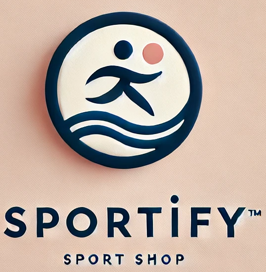
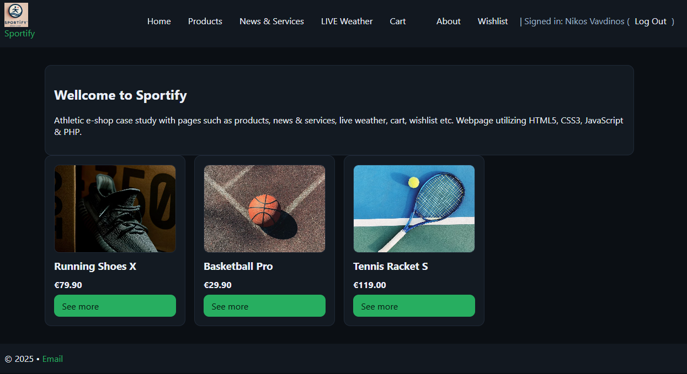
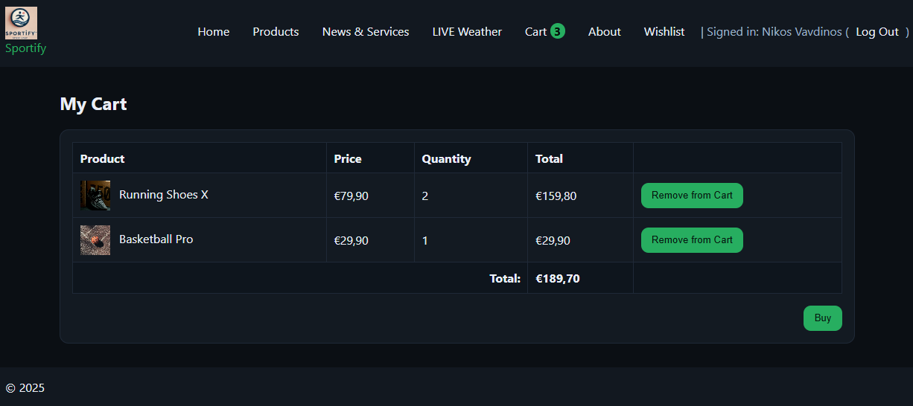
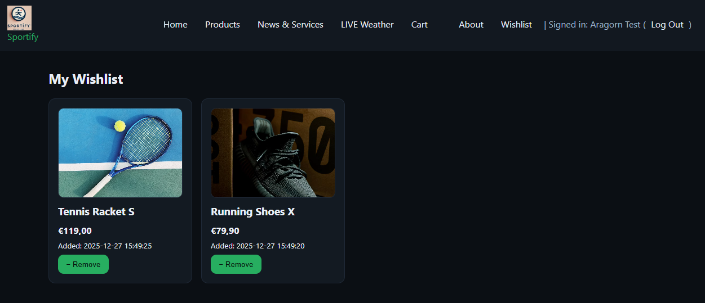
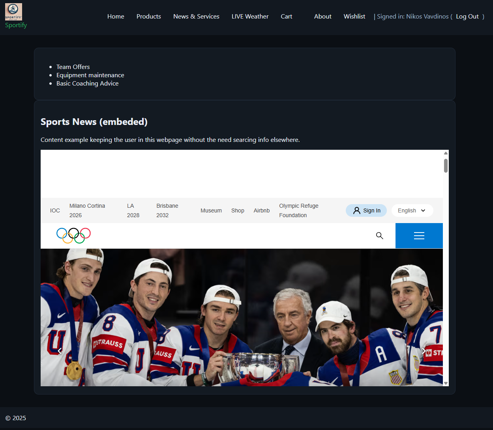
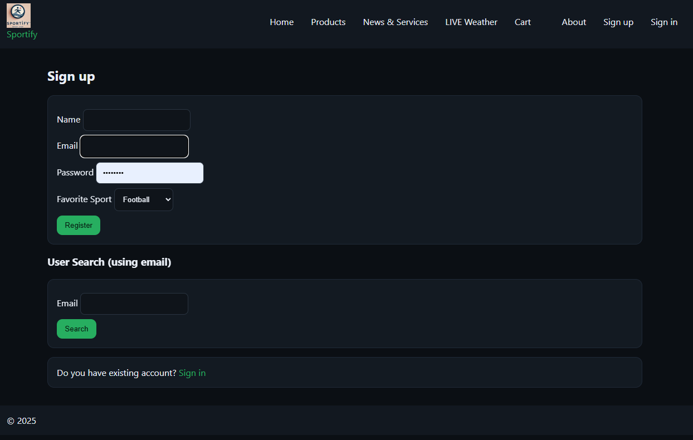
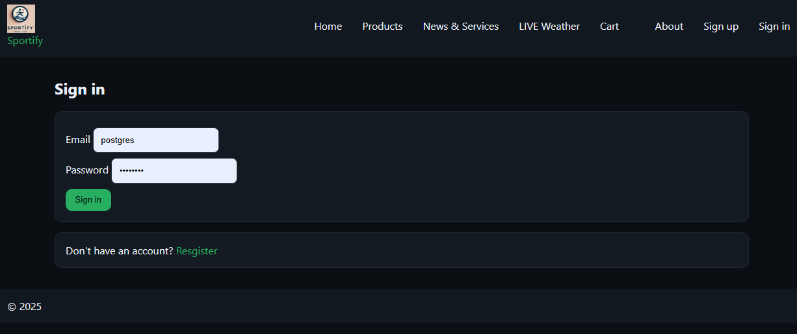

# 🏋️‍♂️ Sportify – Sports Shop Case Study  
*A full-stack web application built by [Nikolaos Lavdakis](mailto:lavdisn@gmail.com)*  



---

[]()
[]()
[]()
[]()

---

## 📄 Project Summary
**Sportify** is a minimalist athletic e-shop web application developed as a **case study** demonstrating full-stack web development skills using **HTML5, CSS3, JavaScript, PHP, and MySQL**.  

The app showcases user-centric features such as authentication, wishlist management, and a client-side shopping cart.  
It was designed with clean UX principles, responsive design, and can run both in **Docker** containers and local environments (XAMPP / WSL2).  

---

## 🎯 Goal
Build a complete, containerized web system simulating a small online sports shop—demonstrating backend logic, frontend responsiveness, and database integration—while keeping the stack simple and transparent for technical recruiters and collaborators.

---

## 🧱 Stack
| Layer | Technology | Purpose |
|-------|-------------|----------|
| Frontend | **HTML5 / CSS3 / Vanilla JS** | Structure, styling, interactivity |
| Backend | **PHP 8.2** | User sessions, auth, wishlist CRUD |
| Database | **MySQL 8.0** | Persistent data storage |
| Containers | **Docker Compose** | Reproducible environment (web + db + adminer) |
| Tools | **Adminer / XAMPP / WSL2** | Alternative local dev setups |

---

## ✨ Key Features
- 🧍‍♂️ **User Authentication:** Secure login/register system using password hashing.  
- ❤️ **Wishlist Management:** Save & remove favorite products per user session.  
- 🛒 **Cart System:** LocalStorage-based cart with dynamic quantity updates.  
- 📰 **Embedded News:** Live sports news feed via iframe.  
- ☀️ **Live Weather:** Real-time weather conditions for Greece embedded from *Meteo.gr*.  
- 📱 **Responsive Design:** Fully adaptive layout using modern CSS grid.  
- ⚙️ **Dockerized Deployment:** Works out of the box with `docker compose up`.  

---

## 🧩 Architecture Overview
```
public/
 ├── assets/
 │   ├── css/style.css
 │   └── js/cart.js
 ├── img/
 │   ├── demo_*.jpg
 │   ├── logo.png
 │   └── screens/
 ├── php/
 │   ├── db.php
 │   ├── session.php
 │   ├── nav.php
 │   ├── wishlist_add.php / wishlist_view.php
 │   ├── login.php / register.php / logout.php
 │   └── remove_favorite.php
 ├── index.php
 ├── products.php
 ├── cart.php
 ├── services.php
 ├── weather.php
 ├── about.php
 ├── docker-compose.yml
 ├── .env.example
 └── sql/schema.sql
```

---

## 🖼️ Screenshots

| Page | Preview |
|------|----------|
| **Home / Index** |  |
| **Cart** |  |
| **Wishlist** |  |
| **Services / News** |  |
| **Weather** |  |
| **Register** |  |
| **Login** |  |


*(All screenshots captured at 1280×720 for portfolio clarity.)*

---

## ⚙️ Setup & Deployment

### 🐳 Option A: Docker (recommended)
```bash
docker compose up -d
```
Then visit:
- Web App → http://localhost:8080  
- Adminer → http://localhost:8081  

Credentials (from `.env.example`):
```
MYSQL_DATABASE=sports_shop
MYSQL_USER=sports_user
MYSQL_PASSWORD=changeme_user
```

---

### 🧩 Option B: XAMPP / WSL2
1. Place the `public/` folder inside `htdocs/sportify/`.
2. Create DB `sports_shop` in phpMyAdmin.
3. Import `sql/schema.sql`.
4. Edit `php/db.php`:
   ```php
   $host = 'localhost';
   $db   = 'sports_shop';
   $user = 'root';
   $pass = '';
   ```
5. Run `http://localhost/sportify/`.

---

## 🧪 Testing Flow
1. Register → Login.  
2. Add products to Wishlist.  
3. Add products to Cart.  
4. Remove / Empty Cart.  
5. Browse embedded Weather and Sports News pages.

---

## 🧠 About the Author
**Nikolaos Lavdakis**  
_Data Scientist & Software Engineer_  
Exploring the intersection of **AI, digital twins, and interactive web systems.**  
LinkedIn: [linkedin.com/in/nikos-lavdakis-317109164](https://www.linkedin.com/in/nikos-lavdakis-317109164/)  
Email: [lavdisn@gmail.com](mailto:lavdisn@gmail.com)

---

## 💡 Future Improvements
- Product filtering & category pages  
- REST API endpoints for data integration  
- Dockerized CI/CD workflow  
- Server-side order management

---

## ⚖️ License

This project is licensed under the **MIT License** — see the [LICENSE](LICENSE) file for details.

```text
MIT License

Copyright (c) 2025 Nikolaos Lavdakis

Permission is hereby granted, free of charge, to any person obtaining a copy
of this software and associated documentation files (the "Software"), to deal
in the Software without restriction, including without limitation the rights
to use, copy, modify, merge, publish, distribute, sublicense, and/or sell
copies of the Software, and to permit persons to whom the Software is
furnished to do so, subject to the following conditions:

The above copyright notice and this permission notice shall be included in all
copies or substantial portions of the Software.

THE SOFTWARE IS PROVIDED "AS IS", WITHOUT WARRANTY OF ANY KIND, EXPRESS OR
IMPLIED, INCLUDING BUT NOT LIMITED TO THE WARRANTIES OF MERCHANTABILITY,
FITNESS FOR A PARTICULAR PURPOSE AND NONINFRINGEMENT. IN NO EVENT SHALL THE
AUTHORS OR COPYRIGHT HOLDERS BE LIABLE FOR ANY CLAIM, DAMAGES OR OTHER
LIABILITY, WHETHER IN AN ACTION OF CONTRACT, TORT OR OTHERWISE, ARISING FROM,
OUT OF OR IN CONNECTION WITH THE SOFTWARE OR THE USE OR OTHER DEALINGS IN THE
SOFTWARE.
```
